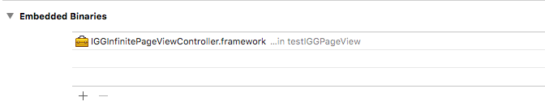

# IGGInfinitePageViewController : Infinite Scroll with custom UIPageViewController
Simply example how to implement Infinite Scroll with UIPageViewController.
In this project i show example in the real world if we want to combine with UITableView and use swipe(scroll) left or right for filter data on tableview row.
This project include delegate function for let us know what is the current index of view controller when your scroll.
<p align="center">

</p>
## Requirements
* Xcode 8
* Swift 3

## Installation
* Build & Copy IGGInfinitePageViewController.framework to your project
* Don't forget add this framework to embedded binaries

* or just copy and paste code to your project

## Setup
* import IGGInfinitePageViewController to your project
```swift
import IGGInfinitePageViewController
```
* set  to your view controller
```swift
override func viewDidLoad() {
        super.viewDidLoad()

        let exampleFrame = view.frame
        
        let vc1 = OneViewController()
        let vc2 = TwoViewController()
        let vc3 = ThreeViewController()
        
        let ifnPageScroll = IGGInfinitePageViewController(frame: exampleFrame, viewControllers: [vc1, vc2, vc3])
        ifnPageScroll.infiniteDelegate = self
        
        // Add to your view
        addChildViewController(ifnPageScroll)
        view.addSubview(ifnPageScroll.view)
        ifnPageScroll.didMove(toParentViewController: self)
        
        pageControl.numberOfPages = 3
        view.bringSubview(toFront: pageControl)
    }
```
* if you want to use with delegate
```swift
extension ViewController: IGGInfinitePageViewDelegate {
    func pageViewCurrentIndex(currentIndex: Int) {
        print("currentIndex : \(currentIndex)")
        pageControl.currentPage = currentIndex
        
        // Do what you want with currentIndex
    }
}
```

## Explain Function & Delegate (Swift 3)
```swift
public func pageViewController(_ pageViewController: UIPageViewController,
                            viewControllerBefore viewController: UIViewController) -> UIViewController? {
        guard let index = controllers.index(of: viewController) else {
            return nil
        }
        
        infiniteDelegate?.pageViewCurrentIndex(index)
        
        if index == 0 {
            return controllers[controllers.count-1]
        }
        
        let previousIndex = index - 1
        return controllers[previousIndex]
    }
    
public func pageViewController(_ pageViewController: UIPageViewController,
                            viewControllerAfter viewController: UIViewController) -> UIViewController? {
        guard let index = controllers.index(of: viewController) else {
            return nil
        }
        
        infiniteDelegate?.pageViewCurrentIndex(index)
        
        let nextIndex = index + 1
        if nextIndex == controllers.count {
            
            return controllers.first
        }
        
        return controllers[nextIndex]
    }

```
* Delegate
```swift
public protocol IGGInfinitePageViewDelegate: class {
    func pageViewCurrentIndex(_ currentIndex: Int)
}
```

## Contact Me

Anak Mirasing

- https://github.com/igroomgrim
- https://www.linkedin.com/in/anakmirasing
- https://twitter.com/igroomgrim
- http://www.igroomgrim.com/
- thaihooligan@hotmail.com
