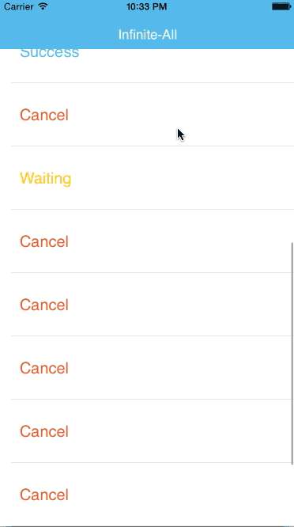

# IGGInfinitePageViewController : Infinite Scroll with custom UIPageViewController
Simply example how to implement Infinite Scroll with UIPageViewController.
In this project i show example in the real world if we want to combine with UITableView and use swipe(scroll) left or right for filter data on tableview row.
This project include delegate function for let us know what is the current index of view controller when your scroll.
<p align="center">

</p>
## Requirements
* Xcode 7 or higher
* Swift 2.0+
* Apple LLVM compiler
* iOS 8.0 or higher
* ARC

## Installation
* Copy IGGInfinitePageViewController.framework to your project
* Don't forget add this framework to embedded binaries
* or just copy and paste code to your project

## Setup
* import IGGInfinitePageViewController to your project
```swift
import IGGInfinitePageViewController
```
* set  to your view controller
```swift
override func viewDidLoad() {
        super.viewDidLoad()

        let exampleFrame = view.frame
        
        let vc1 = OneViewController()
        let vc2 = TwoViewController()
        let vc3 = ThreeViewController()
        
        let ifnPageScroll = IGGInfinitePageViewController(frame: exampleFrame, viewControllers: [vc1, vc2, vc3])
        ifnPageScroll.infiniteDelegate = self
        
        // Add to your view
        addChildViewController(ifnPageScroll)
        view.addSubview(ifnPageScroll.view)
        ifnPageScroll.didMoveToParentViewController(self)
    }
```
* if you want to use with delegate
```swift
extension ViewController: IGGInfinitePageViewDelegate {
    func pageViewCurrentIndex(currentIndex: Int) {
        print("currentIndex : \(currentIndex)")
        
        // Do what you want with currentIndex
    }
}
```

## Explain Function & Delegate (Swift : New Version)
```swift
public func pageViewController(pageViewController: UIPageViewController,
                            viewControllerBeforeViewController viewController: UIViewController) -> UIViewController? {
        guard let index = controllers.indexOf(viewController) else {
            return nil
        }
        
        if index == 0 {
            return controllers[controllers.count-1]
        }
        
        let previousIndex = index - 1
        return controllers[previousIndex]
    }
    
public func pageViewController(pageViewController: UIPageViewController,
                            viewControllerAfterViewController viewController: UIViewController) -> UIViewController? {
    guard let index = controllers.indexOf(viewController) else {
        return nil
    }

    let nextIndex = index + 1
    if nextIndex == controllers.count {
            
        return controllers.first
    }
        
    return controllers[nextIndex]
}

```
* Delegate
```swift
public protocol IGGInfinitePageViewDelegate {
    func pageViewCurrentIndex(currentIndex: Int)
}
```

## Explain Function & Delegate (Obj-C : Old version)
```objective-c
-(RecordListViewController *)viewControllerAtIndex:(NSUInteger)index {
    
    UIStoryboard *mainStoryBoard = [UIStoryboard storyboardWithName:@"Main" bundle:nil];
    RecordListViewController *childVC = [mainStoryBoard instantiateViewControllerWithIdentifier:@"RecordListViewController"];
    childVC.delegate = self;
    childVC.indexNumber = index;
    
    return childVC;
}

#pragma mark - Filter Menu Delegate
-(void)setCurrentFilterIndex:(NSUInteger)filterCurrentIndex {
    currentIndex = filterCurrentIndex;
    [self setHeaderStatus:[filterArray objectAtIndex:currentIndex]];
}

#pragma mark - PageView Datasource
-(UIViewController *)pageViewController:(UIPageViewController *)pageViewController viewControllerBeforeViewController:(UIViewController *)viewController {
    
    NSUInteger index = [(RecordListViewController *)viewController indexNumber];
    
    if (index == 0) {
        
        return [self viewControllerAtIndex:filterArray.count-1];
    }
    index--;
    return [self viewControllerAtIndex:index];
}

-(UIViewController *)pageViewController:(UIPageViewController *)pageViewController viewControllerAfterViewController:(UIViewController *)viewController {
    
    NSUInteger index = [(RecordListViewController *)viewController indexNumber];
    index++;
    if (index == filterArray.count) {
        return [self viewControllerAtIndex:0];;
    }
    return [self viewControllerAtIndex:index];
}

#pragma mark - PageView Delegate
-(void)pageViewScroll:(NSUInteger)index andDirection:(UIPageViewControllerNavigationDirection)direction andAnimate:(BOOL)anim {
    RecordListViewController *vcObject = [self viewControllerAtIndex:index];
    viewsArray = [[NSMutableArray alloc] initWithArray:[NSArray arrayWithObject:vcObject]];
    [pagerView setViewControllers:viewsArray direction:direction animated:anim completion:nil];
}
```

## Contact

Anak Mirasing

- https://github.com/igroomgrim
- https://twitter.com/igroomgrim
- http://www.igroomgrim.com/
- thaihooligan@hotmail.com
